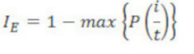
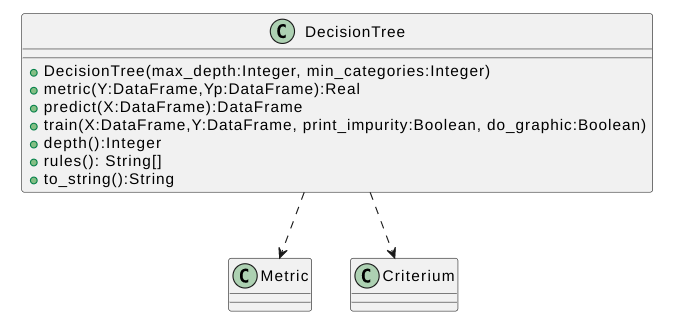

# PTIA-2026-LAB1

# ESCUELA COLOMBIANA DE INGENIERÍA
# PRINCIPIOS Y TECNOLOGÍAS IA 2026-1
## ARBOLES DE DECISIÓN
## LABORATORIO 1/4

**OBJETIVOS**

Desarrollar competencias básicas para:
1. Modelar y resolver problemas usando árboles de decisión
2. Implementar árboles de decisión
3. Apropiar un framework para árboles de decisión (*scikit-learn*)
4. Conocer una librería para procesamiento de datos simbólicos (*python pandas DataFrame*)

**ENTREGABLE**


*Reglas para el envío de los entregables*:

* **Forma de envío:**
  Este laboratorio se debe enviar únicamente a través de la plataforma Moodle en la actividad definida. Se tendrán dos entregas: inicial y final.

* **Formato de los archivos:**
  Incluyan en un archivo *.zip* los archivos correspondientes al laboratorio.

* **Nomenclatura para nombrar los archivos:**
  El archivo deberá ser renombrado, “DT-lab-” seguido por los usuarios institucionales de los autores ordenados alfabéticamente (por ejemplo, se debe adicionar pedroperez al nombre del archivo, si el correo electrónico de Pedro Pérez es pedro.perez@mail.escuelaing.edu.co)

# **PARTE I. IMPLEMENTACIÓN DE ÁRBOLES DE DECISIÓN**
Para este apartado se van a implementar un árbol de decisión, en este caso usando como medida la entropia.

*La idea de los árboles de decisión fue desarrollada paulatinamiente. El pionero más reconocido es Ross Quinlan, quien propuso en 1986 el algoritmo ID3 (Iterative Dichotomiser 3) en el artículo [Induction of decision trees](https://link.springer.com/article/10.1007/BF00116251). Este algoritmo marcó un hito en la construcción automática de árboles de decisión a partir de datos.*

## I.A. IMPLEMENTACIÓN DE UN ÁRBOL DE DECISIÓN

Implementar un árbol de decisión; calculando una salida (Yp) para unas entradas X.

**Propiedades:**

*   Tarea: **Clasificación binaria**
*   Características: **Categóricas**
*   Criterio de selección: **Ganancia de información**
*   Métrica para evaluación : **F1 SCORE**

<div>

</div>

> **Formulas**

*   Impureza : **Entropía: H**

*   Ganancia de información: **IG(D,A)**

*   Impureza de Arbol: **Impurity(V\*)**


## Paso 1. Criterios de selección de atributos
Las impurezas en árboles de decision miden cuán homogéneas o heterogéneas son las clases dentro de un conjunto de datos ***en un nodo del árbol***. La métrica de impureza determina cómo dividir los datos en cada nodo.
Los principales métodos de evaluación de impureza son: **entropía** e **indice gini**.

*Incluyan las formulas de los dos criterios de selección y comparelos considerando criterios como sensibilidad al desbalance de clases y eficiencia computacional*

---
**Entropia:**


---
**Gini**


Donde *Pi* es la probabilidad de que un ejemplo sea de la clase *i*.

---
**Comparación**

La Entropía y el Índice Gini son medidas utilizadas en árboles de decisión para evaluar la impureza de un conjunto de datos y determinar la mejor división en cada nodo.

La Entropía, basada en la teoría de la información, mide el nivel de desorden o incertidumbre en los datos. Su valor va de 0 (conjunto completamente puro) hasta 1 (máxima incertidumbre, en clasificación binaria). Utiliza logaritmos en su cálculo, lo que la hace ligeramente más costosa computacionalmente.

Por otro lado, el Índice Gini mide la probabilidad de clasificar incorrectamente un elemento si se asigna aleatoriamente según la distribución de clases. También toma valores entre 0 (nodo puro) y 0.5 en clasificación binaria (máxima impureza). Su cálculo es más simple porque no utiliza logaritmos, por lo que suele ser más rápido.

En la práctica, ambos criterios suelen producir resultados similares en los árboles de decisión. La principal diferencia radica en que la entropía tiende a penalizar más los conjuntos muy desbalanceados, mientras que Gini es más eficiente computacionalmente y es el criterio usado por defecto en muchos algoritmos como CART.

---

## Paso 2. Ganancia de una característica e impureza del árbol
Los otros dos conceptos de fundamentan los árboles de decisión son la **ganancia de información** y la **impureza *de un arbol***.

---
**Ganancia:**

Es una medida utilizada en los árboles de decisión para cuantificar cuánto disminuye la impureza del conjunto de datos cuando se realiza una división basada en una característica específica. Su objetivo es determinar cuál atributo resulta más adecuado para separar los datos en un nodo del árbol. Cuanto mayor sea la ganancia obtenida, más efectiva es la característica para diferenciar las clases y mayor será la pureza de los subconjuntos generados.


I es la función que mide la impureza

Dp es el dataset "padre" que se está dividiendo

Np es el número de elementos del dataset padre

Dj es el dataset j-ésimo en el que se ha dividido Dp

Nj es el número de elementos del dataset Dj

------------------------------------------------------------------------

**Impureza:**

Las impurezas en árboles de decisiones se encargan de medir que tan homogéneas o heterogéneas son las clases en un conjunto
datos en un nodo del árbol. Ell nodo es puro si tiene ejemplos de solo una clase, es más impuro si hay mezclas entre las clases.

Formulas de impureza:

Entropy:


Gini:


Error de clasificación: Se encarga de medir la proporción de ejemplos que no pertenecen a la clase más común.



--- 

## Paso 3. Implementación del código base para un árbol de decisión

### Librería necesaria

``` python
import pandas as pd
from abc import ABC, abstractmethod
```

### Funciones base: métrica y criterio


### Métrica

``` python
class Metric(ABC):
  """ Abstracta: define entradas, salidas y el comportamiento inicial de los métodos clave para cualquier metrica
  Representa una metrica de desempeño P para evaluar una tarea T
  """
  @classmethod
  def use(cls,name: str):
    """ obtiene metrica (OBJ) a partir del nombre
    Args:
      name  : nombre esperado de la metrica
    Returns:
       objeto metrica
    """
    pass

  def value(self, Y: pd.DataFrame, Yp: pd.DataFrame)->float:
    """ computa el desempeño P
    Args:
      Y   s de salidas esperadas (etiquetadas)
      Yp  : valores de salidas obtenidas
    Return:
      valor del desempeño
    """
    pass
```

``` python
# Documentar los métodos implementados
class Accuracy(Metric):
  """ Metrica de exactitud (acertados / totales). Implementa Metric
  """
  def __new__(cls):
    pass

  def value(self, Y: pd.DataFrame, Yp: pd.DataFrame)->float:
    pass
```

``` python
# Documentar los métodos implementados
class Precision(Metric):
  """ Metrica de precision). Implementa Metric
  """
  def __new__(cls):
    pass

  def value(self, Y: pd.DataFrame, Yp: pd.DataFrame)->float:
    pass
```

``` python
# Documentar los métodos implementados
class Recall(Metric):
  """ Metrica de exhaustividad. Implementa Metric
  """
  def __new__(cls):
    pass

  def value(self, Y: pd.DataFrame, Yp: pd.DataFrame)->float:
    pass
```

``` python
# Documentar los métodos implementados
class F1Score(Metric):
  """ Metrica de media armónica entre Precisión y Exhaustividad. Implementa Metric
  """
  def __new__(cls):
    pass

  def value(self, Y: pd.DataFrame, Yp: pd.DataFrame)->float:
    pass
```

``` python
# Adicione los casos de prueba de los métodos implementados
```

### Criterio

``` python
class Criterium(ABC):
  """ Abstracta: Define el criterio para seleccionar y dar prioridad a los atributos
  Representa la impureza
  """
  @classmethod
  def use(cls, name: str):
    """ obtiene criterio de selección (OBJ) a partir del nombre
    Args:
      name  : nombre esperado del criterio
    Returns:
      objeto criterio de selección
    """
    pass

  def impurity(self, V: pd.DataFrame) -> float:
    """ computa la impureza en un nodo/vértice
    Args:
      V    : ejemplares para una característica
    Returns:
       valor de la impureza del nodo
    """
    pass

  def gain(self, a: str, X: pd.DataFrame, Y: [pd.DataFrame]) -> float:
    """ computa la ganancia de información de un nodo con 1 o más hijos
    Args:
      a  : atributo/característica a evaluar
      X : ejemplares / valores de entrada
      Y : valores de salida esperados
    Returns:
      valor de la ganancia de información
    """
    pass

  def treeImpurity(self, nodes: [pd.DataFrame]) -> float:
    """ computa la impureza de todo un arbol
    Args:
      nodes    : datos de cada uno de los nodos del arbol
    Returns:
      valor de la impureza del arbol
    """
    pass
```

``` python
# Documentar los métodos implementados
class Entropy(Criterium):
  """ Criterio de selección - impureza por entropia
  """
  def __new__(cls):
    pass

  def impurity(self, V: pd.DataFrame) -> float:
    pass

  def gain(self, a: str, X: pd.DataFrame, Y: pd.DataFrame) -> float:
    pass

  def treeImpurity(self, nodes: pd.DataFrame) -> float:
    pass
```

``` python
# Adicione los casos de prueba de los métodos implementados
```

### Árbol de decisión

Para la implementación sigan las decisiones de diseño presentadas en el
diagrama de clases. Pueden incluir los métodos y clases adicionales que
requieran.

#### Nomenclatura

-   **Datos**
    -   *c*: número de características
    -   *m*: número de ejemplares
    -   **x**, **X**: entradas. Un ejemplo (1xc) o todos los ejemplos
        (mxc)
    -   **y**, **Y**: salidas reales. Un ejemplo (1xc) o todos los
        ejemplos(mxc)
    -   **yp**, **Yp**: salidas estimadas. Un ejemplo (1xc) o todos los
        ejemplos(cxm)
    


``` python
class DecisionTree:
  """ Representa un árbol de decisión
  """
  def __init__(self, max_depth: int, min_categories: int):
    """ inicializar la clase de árbol de decisión.
    Args:
      max_depth   : Profundidad máxima del árbol de decisión
      min_categories   : Número mínimo de categorias para dividir un nodo
    """
    pass

  def metric(self, Y: pd.DataFrame, Yp: pd.DataFrame) -> float:
    """ computa la metrica del modelo a partir de los ejemplares comparando las salidas
    Args:
      Y  : valores de salidas esperadas (etiquetadas)
      Yp  : valores de salidas obtenidas
    Return:
       desempeño del modelo para ejemplares
    """
    pass

  def predict(self, X: pd.DataFrame) -> pd.DataFrame:
    """ computa una serie de entradas a traves del arbol generando una predicción
    Args:
      X    : valores de características (entradas)
    Return:
     valores de salidas obtenidas
    """
    pass

  def train(self, X: pd.DataFrame, Y: pd.DataFrame, print_impurity: bool, do_graphic: bool):
    """ construye y entrena el árbol de decisión a partir de unos ejemplares.
    Args:
      X  : valores de características - conjunto de entrenamiento
      Y  : valores de salidas esperadas - conjunto de entrenamiento
      print_impurity : mostrar la impureza del arbol por iteración
      do_graphic: graficar las impurezas por iteración
    """
    pass

  def depth()->int:
    """ consulta la profundidad del árbol
    Return:
      profundidad del árbol
    """
    pass

  def rules() -> [str]:
    """ consultar las reglas del árbol
    Return:
      reglas del árbol de decisión
    """
    pass

  def to_string() -> str:
    """ consultar la estructura del arbol
    Return:
      estructura del árbol
    """
    pass
```
``` python
# Como primer caso de prueba entrene un árbol para calcular el operador lógico and. Explique los resultados.
```

``` python
# Como segundo caso de prueba entrene un árbol para calcular el operador lógico or. Explique los resultados.
```

``` python
# Como tercer caso de prueba entrene un árbol para calcular el operador lógico xor. Explique los resultados.
```

``` python
# Como último caso de prueba entrene un árbol para el dataset propuesto por su profesor. Use 80% para entrenamiento y 20% para pruebas. Explique los resultado.
```

# PARTE II. USO DE FRAMEWORK PARA ÁRBOLES DE DECISIÓN

En esta sección se utilizará una librería que permite entrenar de forma sencilla y flexible distintos modelos basados en árboles de decisión. La librería elegida es **scikit-learn**.

**Scikit-learn** es una biblioteca de Python diseñada para facilitar la aplicación de algoritmos de aprendizaje automático. Su popularidad en el entorno industrial se debe a su facilidad de uso, documentación clara y buen rendimiento computacional.

Dentro de las estrategias de aprendizaje basadas en árboles que ofrece scikit-learn, en este laboratorio se trabajará con las siguientes:

- [DecisionTreeClassifier](https://scikit-learn.org/stable/modules/generated/sklearn.tree.DecisionTreeClassifier.html)
- [RandomForestClassifier](https://scikit-learn.org/stable/search.html?q=RandomForestClassifier)
- [GradientBoostingClassifier](https://scikit-learn.org/stable/modules/generated/sklearn.ensemble.GradientBoostingClassifier.html)

Con estas herramientas se resolverá un problema de clasificación usando el dataset indicado por el docente, dividiendo los datos en **70% entrenamiento**, **10% validación** y **20% pruebas**.

---

## Paso 1: Definir el problema

Antes de construir cualquier modelo, es necesario tener claridad sobre qué se busca resolver y cómo se evaluará su desempeño. Esto supone describir el problema con precisión, seleccionar una métrica de evaluación apropiada (en este caso, el **F1-score**) y fijar un umbral mínimo de rendimiento aceptable.

El objetivo es desarrollar un modelo de clasificación basado en árboles de decisión capaz de predecir si una persona tiene un ingreso anual superior a **$50.000**. Para ello se utilizará información demográfica y laboral proveniente del dataset **Adult Census Income**.

Se trata de un problema de **clasificación binaria supervisada**, ya que las salidas posibles se reducen a dos categorías. El modelo deberá aprender patrones a partir de los datos de entrenamiento y ser capaz de generalizar adecuadamente ante información nueva.

La métrica seleccionada es el **F1-score**, dado que combina precisión y exhaustividad en una sola medida. En problemas de clasificación binaria con posibles desbalances entre clases, esta métrica ofrece una evaluación más representativa del rendimiento real del modelo en comparación con el accuracy.

---

## Paso 2: Explorar y preparar los datos

Para entender la naturaleza de los datos disponibles, es indispensable llevar a cabo una **exploración** apoyada en visualizaciones pertinentes que permitan identificar:

- La distribución de clases y valores
- La existencia de datos nulos o atípicos
- Las relaciones entre variables

La **preparación** de los datos tiene como fin asegurar que el modelo pueda aprender de manera eficiente. Dependiendo de lo que se encuentre en la exploración, este proceso puede incluir:

- Limpieza de registros inconsistentes
- Normalización o estandarización de variables numéricas
- Codificación de variables categóricas
- Partición del conjunto de datos en entrenamiento (**train**), validación (**dev**) y prueba (**test**)

``` python
#Analizar los datos
import pandas as pd
import seaborn as sns
import matplotlib.pyplot as plt
import os

# Obtener ruta absoluta a la carpeta resources
base_path = os.path.join(os.path.dirname(__file__), '../../resources')

train_path = os.path.join(base_path, 'adult.data')
test_path = os.path.join(base_path, 'adult.test')

# Definir nombres de columnas
columns = [
    'age', 'workclass', 'fnlwgt', 'education', 'education-num',
    'marital-status', 'occupation', 'relationship', 'race', 'sex',
    'capital-gain', 'capital-loss', 'hours-per-week', 'native-country', 'income'
]

# Cargar archivos
train_data = pd.read_csv(train_path, names=columns, na_values='?', skipinitialspace=True)
test_data = pd.read_csv(test_path, names=columns, na_values='?', skipinitialspace=True, skiprows=1)

# Unir para análisis conjunto
data = pd.concat([train_data, test_data], axis=0)

# Normalizar la columna 'income'
data['income'] = data['income'].str.replace('.', '', regex=False).str.strip()

print("Dimensiones del dataset:", data.shape)
print("\nPrimeras filas del dataset:")
print(data.head())

print("\nValores nulos por columna:")
print(data.isnull().sum())

print("\nDistribución de la variable objetivo (income):")
print(data['income'].value_counts())

# Distribución de algunas variables numéricas
data[['age', 'hours-per-week', 'education-num']].hist(bins=20, figsize=(10, 5))
plt.suptitle('Distribución de variables numéricas')
plt.show()

# Seleccionar solo columnas numéricas
numeric_data = data.select_dtypes(include=['int64', 'float64'])

# Calcular matriz de correlación
corr_matrix = numeric_data.corr()

# Mostrar la matriz completa
print("\nMatriz de correlación:")
print(corr_matrix)

# Visualización con mapa de calor
plt.figure(figsize=(12, 8))
sns.heatmap(corr_matrix, annot=True, fmt=".2f", cmap="coolwarm")
plt.title("Matriz de correlación entre variables numéricas")
plt.show()
```

*Incluyan observaciones*

``` python
import pandas as pd
import numpy as np
from sklearn.preprocessing import LabelEncoder, StandardScaler
from sklearn.model_selection import train_test_split
import os

# Cargar dataset
base_path = os.path.join(os.path.dirname(__file__), '../../resources')
train_path = os.path.join(base_path, 'adult.data')
test_path = os.path.join(base_path, 'adult.test')

columns = [
    'age', 'workclass', 'fnlwgt', 'education', 'education-num',
    'marital-status', 'occupation', 'relationship', 'race', 'sex',
    'capital-gain', 'capital-loss', 'hours-per-week', 'native-country', 'income'
]

train_data = pd.read_csv(train_path, names=columns, na_values='?', skipinitialspace=True)
test_data = pd.read_csv(test_path, names=columns, na_values='?', skipinitialspace=True, skiprows=1)

data = pd.concat([train_data, test_data], axis=0)
data['income'] = data['income'].str.replace('.', '', regex=False).str.strip()

# Reemplazar valores nulos por la moda de cada columna
for col in data.columns:
    if data[col].isnull().sum() > 0:
        data[col] = data[col].fillna(data[col].mode()[0])

# Codificación de variables categóricas
label_encoders = {}
for col in data.select_dtypes(include='object').columns:
    le = LabelEncoder()
    data[col] = le.fit_transform(data[col])
    label_encoders[col] = le

# Normalización / estandarización de variables numéricas
scaler = StandardScaler()
num_cols = data.select_dtypes(include=['int64', 'float64']).columns
data[num_cols] = scaler.fit_transform(data[num_cols])

# Separar variables predictoras (X) y objetivo (y)
X = data.drop('income', axis=1)
y = data['income']

# División de datos: 70% entrenamiento, 10% validación, 20% prueba
# Primero 70% entrenamiento y 30% temporal (validación + prueba)
X_train, X_temp, y_train, y_temp = train_test_split(X, y, test_size=0.3, random_state=42, stratify=y)

# De los 30% restantes: validación (10%) y prueba (20%)
X_val, X_test, y_val, y_test = train_test_split(X_temp, y_temp, test_size=(2/3), random_state=42, stratify=y_temp)

print("Tamaño del conjunto de entrenamiento:", X_train.shape)
print("Tamaño del conjunto de validación:", X_val.shape)
print("Tamaño del conjunto de prueba:", X_test.shape)


```

## Paso 3: Desarrollar el modelo La estrategia que vamos a seguir es
Desarrollar tres modelos diferentes y escoger entre ellos el mejor
modelo para probarlo.

-   Los tres modelos se entrenan con *train*
-   El mejor modelo se selecciona con *dev*
-   El modelo seleccionado se prueba con *test*

### Paso 3.1: Entrenar los modelos candidatos

#### Paso 3.1.1: Entrenar un árbol de decisión

1.  Se crea una instancia de la clase `DecisionTreeClassifier`
2.  Se entrena (`.fit(X,y)`)
3.  Se consulta la métrica f1 (`.predict(X)` y `f1_score(Y, Y_p)`)

``` python
# Entrenar un árbol de decisión
from sklearn.tree import DecisionTreeClassifier
from sklearn.metrics import f1_score
tree_model = DecisionTreeClassifier(random_state=42)
tree_model.fit(X_train, y_train)

y_pred_tree = tree_model.predict(X_val)
f1_tree = f1_score(y_val, y_pred_tree)

print("F1-score (Árbol de Decisión):", round(f1_tree, 4))
```

#### Paso 3.1.2: Entrenar un bosque aleatorio

1.  Se crea una instancia de la clase `RandomForestClassifier`
2.  Se entrena (`.fit(X,y)`)
3.  Se consulta la métrica f1 (`.predict(X)` y `f1_score(Y, Y_p)`)

``` python
#Entrenar un bosque aleatorio
from sklearn.ensemble import RandomForestClassifier
from sklearn.metrics import f1_score
rf_model = RandomForestClassifier(n_estimators=100, random_state=42)
rf_model.fit(X_train, y_train)

y_pred_rf = rf_model.predict(X_val)
f1_rf = f1_score(y_val, y_pred_rf)

print("F1-score (Bosque Aleatorio):", round(f1_rf, 4))
```

#### Paso 3.1.3: Entrenar un bosque con potenciación de gradiente

1.  Se crea una instancia de la clase `GradientBoostingClassifier`
2.  Se entrena (`.fit(X,y)`)
3.  Se consulta la métrica f1 (`.predict(X)` y `f1_score(Y, Y_p)`)

``` python
#Entrenar el bosque con potenciación de gradiente
from sklearn.ensemble import GradientBoostingClassifier
from sklearn.metrics import f1_score
gb_model = GradientBoostingClassifier(random_state=42)
gb_model.fit(X_train, y_train)

y_pred_gb = gb_model.predict(X_val)
f1_gb = f1_score(y_val, y_pred_gb)

print("F1-score (Gradient Boosting):", round(f1_gb, 4))
```

### Paso 3.2: Seleccionar el mejor modelo

Para seleccionar el modelo se usa el conjunto de datos de validación.

1.  Se consulta la métrica f1 de cada uno de los modelos (.predict(X) y
    f1_score(Y, Y_p))

``` python
scores = {
    'Decision Tree': f1_tree,
    'Random Forest': f1_rf,
    'Gradient Boosting': f1_gb
}

best_model_name = max(scores, key=scores.get)
print("\nMejor modelo según F1 en validación:", best_model_name)
    
```
### Paso 3.3: Probar el modelo seleccionado Ya seleccionado el modelo con
El conjunto de datos de validación, se puede probar su rendimiento con
los datos de prueba.

1.  Se consulta la métrica f1 del modelo (.predict(X) y f1_score(Y,
    Y_p))

``` python
#Evaluar el modelo
if best_model_name == 'Decision Tree':
    best_model = tree_model
elif best_model_name == 'Random Forest':
    best_model = rf_model
else:
    best_model = gb_model

# Evaluar con el conjunto de prueba
y_pred_test = best_model.predict(X_test)
f1_test = f1_score(y_test, y_pred_test)

print("\nF1-score final en el conjunto de prueba:", round(f1_test, 4))
```

## Paso 4: Redactar conclusiones

*Incluyan las conclusiones*

-   Comparen los resultados de entrenamiento de los tres modelos
    incluyendo datos como: altura, impureza, exactitud y número de
    reglas. Presenten tabla y expliquen los datos. Indiquen el modelo
    que escogerían en este punto del proceso justificando la respuesta.

## Métricas Comparativas entre Modelos

| Modelo             | Altura | Nº de reglas | Impureza promedio | Exactitud entrenamiento | Exactitud validación |
|--------------------|--------|---------------|--------------------|--------------------------|------------------------|
| Árbol de Decisión  | 41     | 10,095        | 0.1761             | 0.9999                   | 0.8204                 |
| Bosque Aleatorio   | 44.78  | 10,032.76     | 0.1731             | 0.9998                   | 0.8602                 |
| Gradient Boosting  | 3.00   | 14.96         | 0.0965             | 0.8679                   | 0.8712                 |

Al revisar los datos de la tabla, se pueden observar diferencias estructurales y de desempeño importantes entre los tres enfoques probados.

El **Árbol de Decisión** construyó una estructura de gran tamaño: 41 niveles de profundidad y más de 10.000 reglas generadas. Si bien logró adaptarse casi por completo a los datos de entrenamiento (exactitud de 0.9999), este ajuste excesivo se tradujo en un rendimiento más débil al enfrentarse a datos nuevos (0.8204 en validación), un síntoma claro de sobreajuste.

Por su parte, el **Bosque Aleatorio** aprovecha el trabajo colectivo de múltiples árboles para suavizar las irregularidades que un solo árbol tiende a capturar. Esto se refleja en una mejora visible en validación (0.8602) y en una impureza ligeramente más baja (0.1731), sin sacrificar demasiado en entrenamiento (0.9998).

El **Gradient Boosting** se destaca por operar con árboles mucho más pequeños (profundidad promedio de 3 y cerca de 15 reglas cada uno). Lejos de ser una limitación, esta simplicidad le permite aprender de forma progresiva y controlada, obteniendo resultados muy parejos entre entrenamiento (0.8679) y validación (0.8712), además de la impureza más baja del grupo (0.0965).

---

## Sesgo y Varianza por Modelo

**Árbol de Decisión:**
La brecha entre su exactitud en entrenamiento (0.9999) y validación (0.8204) es la más amplia de los tres modelos. El árbol se especializó tanto en los datos de entrenamiento que perdió capacidad predictiva frente a ejemplos no vistos. Este fenómeno responde a un perfil de **varianza elevada con sesgo reducido**, característico de modelos sobreajustados.

**Bosque Aleatorio:**
Al agregar las predicciones de varios árboles independientes, este modelo logra atenuar el efecto de la varianza sin introducir sesgo significativo. La diferencia entre entrenamiento (0.9998) y validación (0.8602) sigue existiendo, pero es menor que en el árbol individual. Su perfil corresponde a **sesgo bajo con varianza controlada**, aunque aún presente.

**Gradient Boosting:**
Este modelo muestra la mayor coherencia entre sus métricas de entrenamiento (0.8679) y validación (0.8712), con una diferencia prácticamente insignificante. Su proceso de aprendizaje iterativo y regularizado le permite encontrar el punto de equilibrio entre ajuste y generalización, traduciéndose en un perfil de **sesgo bajo y varianza baja**, el más favorable de los tres.

---

## Hallazgos del Modelo Seleccionado

El **Gradient Boosting** fue elegido como modelo final. A continuación se detallan los principales hallazgos obtenidos:

1. **Consistencia entre conjuntos:** La diferencia entre la exactitud de entrenamiento y validación es de apenas 0.0033, lo que confirma que el modelo generaliza de manera confiable.
2. **Divisiones más informativas:** Con una impureza promedio de 0.0965, sus nodos de decisión separan las clases con mayor precisión que los otros dos modelos.
3. **Complejidad estructural reducida:** Cada árbol dentro del ensemble opera con solo 3 niveles de profundidad y alrededor de 15 reglas, lo que simplifica el análisis e interpretación del modelo.
4. **Sin señales de sobreajuste:** A diferencia del árbol individual y, en menor medida, del bosque aleatorio, el Gradient Boosting no reproduce el ruido del entrenamiento, lo cual mejora su desempeño en escenarios reales.
5. **Mejor trade-off sesgo-varianza:** De los tres modelos evaluados, es el único que logra mantener un sesgo bajo sin incurrir en una varianza excesiva, consolidándose como la opción más robusta para este problema de clasificación.

### Resultados del modelo seleccionado: Gradient Boosting

**Desempeño general:**

- F1-score en validación: 0.6921

- F1-score en prueba: 0.6848

- Exactitud en entrenamiento: 0.8679

- Exactitud en validación: 0.8712

- Altura promedio de los árboles: 3.00

- Número promedio de reglas: 14.96

- Impureza promedio: 0.0965

**Hallazgos:**

1. El modelo Gradient Boosting logró el mejor rendimiento tanto en validación como en prueba.

2. Su F1-score es mas alto en comparacion de los otros dos modelos, indicando una mejor capacidad para manejar clases desbalanceadas.

3. A diferencia del Árbol de Decisión y el Bosque Aleatorio, el modelo no presenta sobreajuste, dado que sus resultados en entrenamiento y validación son muy similares.

4. Al tener un valor bajo en la altura promedio y tener el menor número de reglas demuestran que el modelo es más eficiente y menos complejo, manteniendo buena capacidad predictiva.

5. Su impureza promedio reducida (0.0965) refleja divisiones más puras y decisiones más precisas dentro del conjunto de árboles.  


## RETROSPECTIVA

**1. Tiempo total invertido por integrante**

| Integrante         | Horas dedicadas |
|--------------------|-----------------|
| Valeria Bermudez   | 7 horas         |
| Juan Andres Suarez | 7 horas         |

---

**2. Estado actual del laboratorio**

El laboratorio se encuentra en su totalidad completado. Todas las secciones fueron abordadas dentro del tiempo disponible, permitiendo un desarrollo ordenado y sin pendientes al momento de la entrega.

---

**3. Mayor logro del equipo**

El logro más significativo fue conseguir entrenar satisfactoriamente los tres modelos sobre el dataset asignado. El proceso no estuvo exento de dificultades, pero la capacidad del equipo para identificar y superar cada obstáculo permitió llegar a resultados sólidos y coherentes.

---

**4. Mayor problema técnico y cómo se resolvió**

Durante la fase de preparación de los datos se detectó que el dataset contenía registros con valores no válidos: algunos campos presentaban el carácter `?` en lugar de un valor real, y otros incluían puntos al final de las entradas, lo que afectaba la estructura esperada de los datos. Para resolverlo, se implementó una etapa de limpieza que identificó y trató estos registros antes de alimentar los modelos, garantizando la integridad del conjunto de entrenamiento.

---

**5. Fortalezas del equipo y compromisos de mejora**

Como equipo se destacó la coordinación durante todo el desarrollo del laboratorio, lo que facilitó la distribución de tareas y el avance continuo. Como compromiso, el equipo se propone mantener este nivel de organización y profundizar aún más en la comprensión teórica de los modelos trabajados para enriquecer el análisis en futuros laboratorios.

---

**6. Referencias utilizadas**

A continuación se listan las fuentes consultadas durante el desarrollo del laboratorio:

- Géron, A. (2019). *Hands-On Machine Learning with Scikit-Learn, Keras, and TensorFlow* (2nd ed.). O'Reilly Media.
- Scikit-learn developers. (2024). *Decision Trees*. Scikit-learn Documentation. https://scikit-learn.org/stable/modules/tree.html
- Scikit-learn developers. (2024). *Ensemble methods*. Scikit-learn Documentation. https://scikit-learn.org/stable/modules/ensemble.html
- Breiman, L. (2001). Random Forests. *Machine Learning, 45*(1), 5–32. https://doi.org/10.1023/A:1010933404324

La referencia más útil fue la documentación oficial de scikit-learn sobre árboles de decisión, ya que ofrece una explicación clara de su funcionamiento, los parámetros disponibles y los criterios para seleccionar el modelo más adecuado según el contexto del problema.

## Bibliografia
Guerard_Guillaume. (2024, February 16). 3 Mesures : Impureté de Gini, entropie et erreur de classification - Complex systems and AI. Sistemas Complejos E IA. https://complex-systems-ai.com/es/analisis-de-datos/entropia-y-error-de-gini/#
DecisionTreeClassifier. (s. f.). Scikit-learn. https://scikit-learn.org/stable/modules/generated/sklearn.tree.DecisionTreeClassifier.html
Search - scikit-learn 1.7.2 documentation. (s. f.). https://scikit-learn.org/stable/search.html?q=RandomForestClassifier
GradientBoostingClassifier. (s. f.). Scikit-learn. https://scikit-learn.org/stable/modules/generated/sklearn.ensemble.GradientBoostingClassifier.html
Javier. (2025, 24 enero). Impurezas en arboles de decision. https://www.iayprogramacion.com/impurezas-en-arboles-de-decision-indice-gini-entropia-y-error-de-clasificacion
Ferrero, R. (2025, 23 mayo). Árboles de decisión: qué son, cómo funcionan y cuándo usarlos. Máxima Formación. https://www.maximaformacion.es/blog-dat/que-son-los-arboles-de-decision-y-para-que-sirven
Hankare, O. (2023, 29 enero). Decision Trees. Medium. https://ompramod.medium.com/decision-trees-91530198a5a5
Ganancia de información | Interactive Chaos. (s. f.). https://interactivechaos.com/es/manual/tutorial-de-machine-learning/ganancia-de-informacion