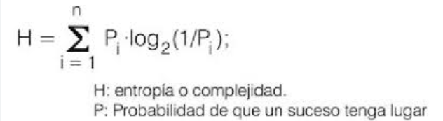
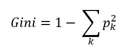
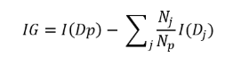
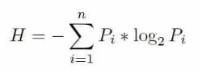
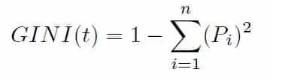
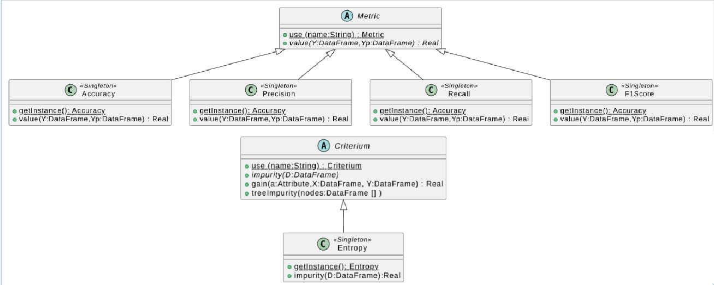

# PTIA-2026-LAB1

# ESCUELA COLOMBIANA DE INGENIERÍA
# PRINCIPIOS Y TECNOLOGÍAS IA 2026-1
## ARBOLES DE DECISIÓN
## LABORATORIO 1/4

**OBJETIVOS**

Desarrollar competencias básicas para:
1. Modelar y resolver problemas usando árboles de decisión
2. Implementar árboles de decisión
3. Apropiar un framework para árboles de decisión (*scikit-learn*)
4. Conocer una librería para procesamiento de datos simbólicos (*python pandas DataFrame*)

**ENTREGABLE**


*Reglas para el envío de los entregables*:

* **Forma de envío:**
  Este laboratorio se debe enviar únicamente a través de la plataforma Moodle en la actividad definida. Se tendrán dos entregas: inicial y final.

* **Formato de los archivos:**
  Incluyan en un archivo *.zip* los archivos correspondientes al laboratorio.

* **Nomenclatura para nombrar los archivos:**
  El archivo deberá ser renombrado, “DT-lab-” seguido por los usuarios institucionales de los autores ordenados alfabéticamente (por ejemplo, se debe adicionar pedroperez al nombre del archivo, si el correo electrónico de Pedro Pérez es pedro.perez@mail.escuelaing.edu.co)

# **PARTE I. IMPLEMENTACIÓN DE ÁRBOLES DE DECISIÓN**
Para este apartado se van a implementar un árbol de decisión, en este caso usando como medida la entropia.

*La idea de los árboles de decisión fue desarrollada paulatinamiente. El pionero más reconocido es Ross Quinlan, quien propuso en 1986 el algoritmo ID3 (Iterative Dichotomiser 3) en el artículo [Induction of decision trees](https://link.springer.com/article/10.1007/BF00116251). Este algoritmo marcó un hito en la construcción automática de árboles de decisión a partir de datos.*

## I.A. IMPLEMENTACIÓN DE UN ÁRBOL DE DECISIÓN

Implementar un árbol de decisión; calculando una salida (Yp) para unas entradas X.

**Propiedades:**

*   Tarea: **Clasificación binaria**
*   Características: **Categóricas**
*   Criterio de selección: **Ganancia de información**
*   Métrica para evaluación : **F1 SCORE**

<div>

</div>

> **Formulas**

*   Impureza : **Entropía: H**

*   Ganancia de información: **IG(D,A)**

*   Impureza de Arbol: **Impurity(V\*)**


## Paso 1. Criterios de selección de atributos
Las impurezas en árboles de decision miden cuán homogéneas o heterogéneas son las clases dentro de un conjunto de datos ***en un nodo del árbol***. La métrica de impureza determina cómo dividir los datos en cada nodo.
Los principales métodos de evaluación de impureza son: **entropía** e **indice gini**.

*Incluyan las formulas de los dos criterios de selección y comparelos considerando criterios como sensibilidad al desbalance de clases y eficiencia computacional*

---
**Entropia:**



---
**Gini**



Donde *Pi* es la probabilidad de que un ejemplo sea de la clase *i*.

---
**Comparación**

La Entropía y el Índice Gini son medidas utilizadas en árboles de decisión para evaluar la impureza de un conjunto de datos y determinar la mejor división en cada nodo.

La Entropía, basada en la teoría de la información, mide el nivel de desorden o incertidumbre en los datos. Su valor va de 0 (conjunto completamente puro) hasta 1 (máxima incertidumbre, en clasificación binaria). Utiliza logaritmos en su cálculo, lo que la hace ligeramente más costosa computacionalmente.

Por otro lado, el Índice Gini mide la probabilidad de clasificar incorrectamente un elemento si se asigna aleatoriamente según la distribución de clases. También toma valores entre 0 (nodo puro) y 0.5 en clasificación binaria (máxima impureza). Su cálculo es más simple porque no utiliza logaritmos, por lo que suele ser más rápido.

En la práctica, ambos criterios suelen producir resultados similares en los árboles de decisión. La principal diferencia radica en que la entropía tiende a penalizar más los conjuntos muy desbalanceados, mientras que Gini es más eficiente computacionalmente y es el criterio usado por defecto en muchos algoritmos como CART.

---

## Paso 2. Ganancia de una característica e impureza del árbol
Los otros dos conceptos de fundamentan los árboles de decisión son la **ganancia de información** y la **impureza *de un arbol***.

---
**Ganancia:**

Es una medida utilizada en los árboles de decisión para cuantificar cuánto disminuye la impureza del conjunto de datos cuando se realiza una división basada en una característica específica. Su objetivo es determinar cuál atributo resulta más adecuado para separar los datos en un nodo del árbol. Cuanto mayor sea la ganancia obtenida, más efectiva es la característica para diferenciar las clases y mayor será la pureza de los subconjuntos generados.




I es la función que mide la impureza

Dp es el dataset "padre" que se está dividiendo

Np es el número de elementos del dataset padre

Dj es el dataset j-ésimo en el que se ha dividido Dp

Nj es el número de elementos del dataset Dj

------------------------------------------------------------------------

**Impureza:**

Las impurezas en árboles de decisiones se encargan de medir que tan homogéneas o heterogéneas son las clases en un conjunto
datos en un nodo del árbol. Ell nodo es puro si tiene ejemplos de solo una clase, es más impuro si hay mezclas entre las clases.

Formulas de impureza:

Entropy:




Gini:




Error de clasificación: Se encarga de medir la proporción de ejemplos que no pertenecen a la clase más común.


--- 

## Paso 3. Implementación del código base para un árbol de decisión

### Librería necesaria

``` python
import pandas as pd
from abc import ABC, abstractmethod
```

### Funciones base: métrica y criterio



### Métrica

``` python
class Metric(ABC):
  """ Abstracta: define entradas, salidas y el comportamiento inicial de los métodos clave para cualquier metrica
  Representa una metrica de desempeño P para evaluar una tarea T
  """
  @classmethod
  def use(cls,name: str):
    """ obtiene metrica (OBJ) a partir del nombre
    Args:
      name  : nombre esperado de la metrica
    Returns:
       objeto metrica
    """
    pass

  def value(self, Y: pd.DataFrame, Yp: pd.DataFrame)->float:
    """ computa el desempeño P
    Args:
      Y   s de salidas esperadas (etiquetadas)
      Yp  : valores de salidas obtenidas
    Return:
      valor del desempeño
    """
    pass
```

``` python
# Documentar los métodos implementados
class Accuracy(Metric):
  """ Metrica de exactitud (acertados / totales). Implementa Metric
  """
  def __new__(cls):
    pass

  def value(self, Y: pd.DataFrame, Yp: pd.DataFrame)->float:
    pass
```

``` python
# Documentar los métodos implementados
class Precision(Metric):
  """ Metrica de precision). Implementa Metric
  """
  def __new__(cls):
    pass

  def value(self, Y: pd.DataFrame, Yp: pd.DataFrame)->float:
    pass
```

``` python
# Documentar los métodos implementados
class Recall(Metric):
  """ Metrica de exhaustividad. Implementa Metric
  """
  def __new__(cls):
    pass

  def value(self, Y: pd.DataFrame, Yp: pd.DataFrame)->float:
    pass
```

``` python
# Documentar los métodos implementados
class F1Score(Metric):
  """ Metrica de media armónica entre Precisión y Exhaustividad. Implementa Metric
  """
  def __new__(cls):
    pass

  def value(self, Y: pd.DataFrame, Yp: pd.DataFrame)->float:
    pass
```

``` python
# Adicione los casos de prueba de los métodos implementados
```

### Criterio

``` python
class Criterium(ABC):
  """ Abstracta: Define el criterio para seleccionar y dar prioridad a los atributos
  Representa la impureza
  """
  @classmethod
  def use(cls, name: str):
    """ obtiene criterio de selección (OBJ) a partir del nombre
    Args:
      name  : nombre esperado del criterio
    Returns:
      objeto criterio de selección
    """
    pass

  def impurity(self, V: pd.DataFrame) -> float:
    """ computa la impureza en un nodo/vértice
    Args:
      V    : ejemplares para una característica
    Returns:
       valor de la impureza del nodo
    """
    pass

  def gain(self, a: str, X: pd.DataFrame, Y: [pd.DataFrame]) -> float:
    """ computa la ganancia de información de un nodo con 1 o más hijos
    Args:
      a  : atributo/característica a evaluar
      X : ejemplares / valores de entrada
      Y : valores de salida esperados
    Returns:
      valor de la ganancia de información
    """
    pass

  def treeImpurity(self, nodes: [pd.DataFrame]) -> float:
    """ computa la impureza de todo un arbol
    Args:
      nodes    : datos de cada uno de los nodos del arbol
    Returns:
      valor de la impureza del arbol
    """
    pass
```

``` python
# Documentar los métodos implementados
class Entropy(Criterium):
  """ Criterio de selección - impureza por entropia
  """
  def __new__(cls):
    pass

  def impurity(self, V: pd.DataFrame) -> float:
    pass

  def gain(self, a: str, X: pd.DataFrame, Y: pd.DataFrame) -> float:
    pass

  def treeImpurity(self, nodes: pd.DataFrame) -> float:
    pass
```

``` python
# Adicione los casos de prueba de los métodos implementados
```

### Árbol de decisión

Para la implementación sigan las decisiones de diseño presentadas en el
diagrama de clases. Pueden incluir los métodos y clases adicionales que
requieran.

#### Nomenclatura

-   **Datos**
    -   *c*: número de características
    -   *m*: número de ejemplares
    -   **x**, **X**: entradas. Un ejemplo (1xc) o todos los ejemplos
        (mxc)
    -   **y**, **Y**: salidas reales. Un ejemplo (1xc) o todos los
        ejemplos(mxc)
    -   **yp**, **Yp**: salidas estimadas. Un ejemplo (1xc) o todos los
        ejemplos(cxm)
    


``` python
class DecisionTree:
  """ Representa un árbol de decisión
  """
  def __init__(self, max_depth: int, min_categories: int):
    """ inicializar la clase de árbol de decisión.
    Args:
      max_depth   : Profundidad máxima del árbol de decisión
      min_categories   : Número mínimo de categorias para dividir un nodo
    """
    pass

  def metric(self, Y: pd.DataFrame, Yp: pd.DataFrame) -> float:
    """ computa la metrica del modelo a partir de los ejemplares comparando las salidas
    Args:
      Y  : valores de salidas esperadas (etiquetadas)
      Yp  : valores de salidas obtenidas
    Return:
       desempeño del modelo para ejemplares
    """
    pass

  def predict(self, X: pd.DataFrame) -> pd.DataFrame:
    """ computa una serie de entradas a traves del arbol generando una predicción
    Args:
      X    : valores de características (entradas)
    Return:
     valores de salidas obtenidas
    """
    pass

  def train(self, X: pd.DataFrame, Y: pd.DataFrame, print_impurity: bool, do_graphic: bool):
    """ construye y entrena el árbol de decisión a partir de unos ejemplares.
    Args:
      X  : valores de características - conjunto de entrenamiento
      Y  : valores de salidas esperadas - conjunto de entrenamiento
      print_impurity : mostrar la impureza del arbol por iteración
      do_graphic: graficar las impurezas por iteración
    """
    pass

  def depth()->int:
    """ consulta la profundidad del árbol
    Return:
      profundidad del árbol
    """
    pass

  def rules() -> [str]:
    """ consultar las reglas del árbol
    Return:
      reglas del árbol de decisión
    """
    pass

  def to_string() -> str:
    """ consultar la estructura del arbol
    Return:
      estructura del árbol
    """
    pass
```
``` python
# Como primer caso de prueba entrene un árbol para calcular el operador lógico and. Explique los resultados.
```

``` python
# Como segundo caso de prueba entrene un árbol para calcular el operador lógico or. Explique los resultados.
```

``` python
# Como tercer caso de prueba entrene un árbol para calcular el operador lógico xor. Explique los resultados.
```

``` python
# Como último caso de prueba entrene un árbol para el dataset propuesto por su profesor. Use 80% para entrenamiento y 20% para pruebas. Explique los resultado.
```